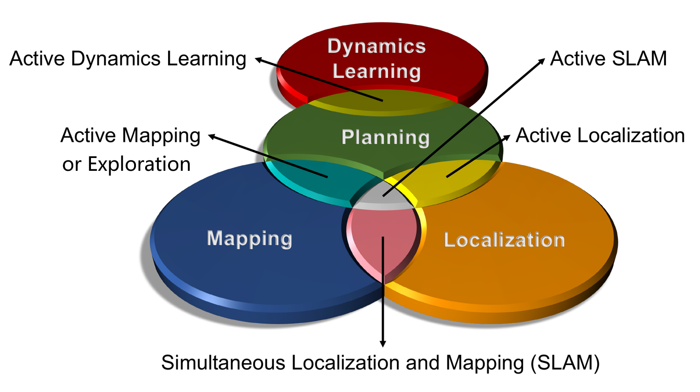

# Active SLAM Paper List

(This figure is referenced from [PyPolo](https://github.com/Weizhe-Chen/PyPolo).)

The autonomous robotic system is a key objective pursued by many researchers in the field of robotics. In recent years, advancements in state estimators, motion planning algorithms, 3D representations, and even large language models (LLMs) have led to a surge of efforts aimed at achieving autonomy through Active SLAM. This approach has become a focal point for developing systems capable of navigating and interacting with complex environments independently.

This repository organizes relevant papers in the Active SLAM domain according to the author's perspective. It is important to note that the classification used in the repository reflects the author's viewpoint; in reality, many similar works are difficult to categorize satisfactorily.

## Overview

- [Survey Paper](#survey-paper)
- [1 Robotic Exploration](#1-robotic-exploration)
  - [1.1 Single Robot](1.1-Single-Robot)
  - [1.2 Multi-robot System](#1.2-Multi-robot-System)
  - [1.3 Neural-based Exploration](#1.3-Neural-based-Exploration)
  - [1.4 Reinforcement Learning-based Exploration](#1.4-Reinforcement-Learning-based-Exploration)
  - [1.5 Visual Language Navigation/Exploration](#1.5-Visual-Language-NavigationExploration)
- [2 Active SLAM](#2-Active-SLAM)
- [3 Active Loop Closure](#3-Active-Loop-Closure)
- [4 Active Reconstruction/Mapping](#4-Active-ReconstructionMapping)
  - [4.1 Single Object](#4.1-Single-Object)
  - [4.2 Entire Scene](#4.2-Entire-Scene)
- [5 Active Localization](#5-Active-Localization)
  - [5.1 Active Object/Source Localization](#5.1-Active-ObjectSource-Localization)
  - [5.2 Active Self-localization](#5.2-Active-Self-localization)
- [6 Robotic/Active Information Gathering](#6-RoboticActive-Information-Gathering)

## Survey Paper

- Past, Present, and Future of Simultaneous Localization and Mapping: Toward the Robust-Perception Age, *TRO 2016*. [[Paper](https://arxiv.org/pdf/1606.05830.pdf)]
- A survey on active simultaneous localization and mapping: State of the art and new frontiers, *TRO 2023*. [[Paper](https://arxiv.org/pdf/2207.00254)]
- Active slam: A review on last decade, *Sensors 2023*. [[Paper](https://www.mdpi.com/1424-8220/23/19/8097)]
- A Survey of Deep Network Solutions for Learning Control in Robotics: From Reinforcement to Imitation, *arXiv 2016*. [[Paper](https://arxiv.org/pdf/1612.07139)]
- A Survey on the autonomous exploration of confined subterranean spaces: Perspectives from real-word and industrial robotic deployments, *RAS 2016*. [[Paper](https://www.sciencedirect.com/science/article/abs/pii/S0921889022001932)]

## 1 Robotic Exploration

#### 1.1 Single Robot

- A frontier-based approach for autonomous exploration, *CIRA 1997*. [[Paper](http://www.robotfrontier.com/papers/cira97.pdf)]
- Active Monocular Localization: Towards Autonomous Monocular Exploration for Multirotor MAV, *ICRA 2014*. [[Paper](https://www.researchgate.net/profile/Christian-Mostegel/publication/261476118_Active_Monocular_Localization_Towards_Autonomous_Monocular_Exploration_for_Multirotor_MAVs/links/0f3175346418523fbe000000/Active-Monocular-Localization-Towards-Autonomous-Monocular-Exploration-for-Multirotor-MAVs.pdf)]
- Autonomous Exploration of Visually–Degraded Environments using Aerial Robots, *ICUAS 2017*. [[Paper](https://www.researchgate.net/profile/Shehryar-Khattak/publication/318899705_Autonomous_Exploration_of_Visually-Degraded_Environments_Using_Aerial_Robots/links/604fadf892851cd8ce43f960/Autonomous-Exploration-of-Visually-Degraded-Environments-Using-Aerial-Robots.pdf)]
- Confidence-rich Localization and Mapping based on Particle Filter for Robotic Exploration, *IROS 2022*. [[Paper](https://arxiv.org/pdf/2202.09631.pdf)]
- TARE: A Hierarchical Framework for Efficiently Exploring Complex 3D Environments, *RSS 2021*. [[Paper](http://www.hongbiaoz.com/files/paper5.pdf)]
- Graph-based Topological Exploration Planning in Large-scale 3D Environments, *ICRA 2021*. [[Paper](https://arxiv.org/pdf/2103.16829)]
- Three-dimensional Terrain Aware Autonomous Exploration for Subterranean and Confined Spaces, *ICRA 2021*. [[Paper](https://ieeexplore.ieee.org/abstract/document/9561099)]
- A Hierarchical Approach for Mobile Robot Exploration in Pedestrian Crowd, *RAL 2022*. [[Paper](https://ieeexplore.ieee.org/abstract/document/9562274)]
- Estimating Map Completeness in Robot Exploration, *arXiv 2024*. [[Paper](https://arxiv.org/pdf/2406.13482)]
- 3D Active Metric-Semantic SLAM, *RAL 2024*. [[Paper](https://arxiv.org/pdf/2309.06950)] [[Code](https://github.com/tyuezhan/RAL24-3DAMSSLAM)]
- Enhancing Exploration Efficiency using Uncertainty-Aware Information Prediction, *arXiv 2024*. [[Paper](https://arxiv.org/pdf/2412.12825)]
- A Skeleton-Based Topological Planner for Exploration in Complex Unknown Environments, *arXiv 2024*. [[Paper](https://arxiv.org/pdf/2412.13664)] [[Code](https://github.com/Haochen-Niu/STGPlanner)]
- MapEx: Indoor Structure Exploration with Probabilistic Information Gain from Global Map Predictions, *arXiv 2024*. [[Paper](https://arxiv.org/pdf/2409.15590)]
- HEROS: Hierarchical Exploration with Online Subregion Updating for 3D Environment Coverage, *arXiv 2024*. [[Paper](https://arxiv.org/pdf/2407.11326)] [[Code](https://github.com/bit-lsj/HEROS)]
- HPHS: Hierarchical Planning based on Hybrid Frontier Sampling for Unknown Environments Exploration, *IROS 2024*. [[Paper](https://arxiv.org/pdf/2407.10660)] [[Code](https://github.com/bit-lsj/HPHS)]

#### 1.2 Multi-robot System

- Multi-Robot Collaborative Dense Scene Reconstruction, *TOG 2019*. [[Paper](https://kevinkaixu.net/papers/dong_sig19_multirobot.pdf)]
- Multi-Robot Active Mapping via Neural Bipartite Graph Matching, *CVPR 2022*. [[Paper](https://openaccess.thecvf.com/content/CVPR2022/papers/Ye_Multi-Robot_Active_Mapping_via_Neural_Bipartite_Graph_Matching_CVPR_2022_paper.pdf)]
- Frontier-Based Exploration for Multi-Robot Rendezvous in Communication-Restricted Unknown Environments, *arXiv 2024*. [[Paper](https://arxiv.org/pdf/2403.11617)]
- Multi-Agent Autonomy: Advancements and Challenges in Subterranean Exploration, *arXiv 2021*. [[Paper](https://arxiv.org/pdf/2110.04390)]

#### 1.3 Neural-based Exploration

- Learning to plan in high dimensions via neural exploration-exploitation trees, *ICLR 2020*. [[Paper](https://arxiv.org/pdf/1903.00070)] 
- Neural Topological SLAM for Visual Navigation, *CVPR 2020*. [[Paper](https://openaccess.thecvf.com/content_CVPR_2020/papers/Chaplot_Neural_Topological_SLAM_for_Visual_Navigation_CVPR_2020_paper.pdf)] [[Website](https://devendrachaplot.github.io/projects/Neural-Topological-SLAM)]
- Object Goal Navigation using Goal-Oriented Semantic Exploration, *NeurIPS 2020*,  [[Paper](https://proceedings.neurips.cc/paper/2020/file/2c75cf2681788adaca63aa95ae028b22-Paper.pdf)] [[Code](https://github.com/devendrachaplot/Object-Goal-Navigation)]
- Learning to Explore using Active Neural SLAM, *ICLR  2020*. [[Paper](https://arxiv.org/pdf/2004.05155)] [[Code](https://github.com/devendrachaplot/Neural-SLAM)] [[Website](https://devendrachaplot.github.io/projects/Neural-SLAM)]
- DARE: Diffusion Policy for Autonomous Robot Exploration, *arXiv 2024*. [[Paper](https://arxiv.org/pdf/2410.16687)]

#### 1.4 Reinforcement Learning-based Exploration

- Towards cognitive exploration through deep reinforcement learning for mobile robots, *arXiv 2016*. [[Paper](https://arxiv.org/pdf/1610.01733)]
- A Robot Exploration Strategy Based on Q-learning Network, *RCAR 2016*. [[Paper](https://onlytailei.github.io/papers/rcar_2016.pdf)]
- Neural SLAM: Learning to Explore with External Memory, *arXiv 2017*. [[Paper](https://www.researchgate.net/profile/Lei-Tai/publication/318029164_Neural_SLAM_Learning_to_Explore_with_External_Memory/links/5a59ec3b0f7e9b5fb3854df7/Neural-SLAM-Learning-to-Explore-with-External-Memory.pdf)]
- Toward autonomous mapping and exploration for mobile robots through deep supervised learning, *IROS 2017*. [[Paper](https://www.researchgate.net/profile/Shi-Bai-3/publication/321816564_Toward_autonomous_mapping_and_exploration_for_mobile_robots_through_deep_supervised_learning/links/5fa595b992851cc2869cb427/Toward-autonomous-mapping-and-exploration-for-mobile-robots-through-deep-supervised-learning.pdf)] 
- Deep reinforcement learning-based automatic exploration for navigation in unknown environment, *TNNLS 2019*. [[Paper](https://arxiv.org/pdf/2007.11808)]
- Self-Learning Exploration and Mapping for Mobile Robots via Deep Reinforcement Learning, *Aiaa scitech 2019 forum*. [[Paper](https://personal.stevens.edu/~benglot/aiaa2019-Fanfei-Chen.pdf)]
- A deep reinforcement learning approach for active SLAM, *Applied Sciences 2020*. [[Paper](https://www.mdpi.com/2076-3417/10/23/8386)]
- Autonomous exploration under uncertainty via deep reinforcement learning on graphs, *IROS 2020*. [[Paper](https://arxiv.org/pdf/2007.12640)]
- Zero-Shot Reinforcement Learning on Graphs for Autonomous Exploration Under Uncertainty, *ICRA 2021*. [[Paper](https://arxiv.org/pdf/2105.04758)]
- Explore-bench: Data sets, metrics and evaluations for frontier-based and deep-reinforcement-learning-based autonomous exploration, *ICRA 2022*. [[Paper](https://arxiv.org/pdf/2202.11931)] [[Code](https://github.com/efc-robot/Explore-Bench)]
- CSO: Constraint-guided Space Optimization for Active Scene Mapping, *MM 2023*. [[[Paper](https://openreview.net/pdf?id=Tc51JqJzq6)]
- Ariadne: A reinforcement learning approach using attention-based deep networks for exploration, *ICRA 2023*. [[Paper](https://arxiv.org/pdf/2301.11575)]
- Off-policy evaluation with online adaptation for robot exploration in challenging environments, *RAL 2023*. [[Paper](https://arxiv.org/pdf/2204.03140)]
- IR2 : Implicit Rendezvous for Robotic Exploration Teams under Sparse Intermittent Connectivity, *IROS 2024*. [[Paper](https://arxiv.org/pdf/2409.04730)] [[Code](https://github.com/marmotlab/IR2-Multi-Robot-RL-Exploration)]
- HDPlanner: Advancing Autonomous Deployments in Unknown Environments through Hierarchical Decision Networks, *RAL 2024*. [[Paper](https://arxiv.org/pdf/2408.03768)] [[Code](https://github.com/marmotlab/HDPlanner_Exp_and_Nav)]
- Privileged Reinforcement and Communication Learning for Distributed, Bandwidth-limited Multi-robot Exploration, *arXiv 2024*. [[Paper](https://arxiv.org/pdf/2407.20203)] [[Code](https://github.com/marmotlab/Bandwidth-Limited-Multi-Robot-Exploration)]
- Deep Reinforcement Learning-based Large-scale Robot Exploration, *RAL 2024*. [[Paper](https://arxiv.org/pdf/2403.10833)]

#### 1.5 Visual Language Navigation/Exploration

- Vlfm: Vision-language frontier maps for zero-shot semantic navigation, *ICRA 2024*. [[Paper](https://arxiv.org/pdf/2312.03275)] [[Code](https://github.com/bdaiinstitute/vlfm)] [[Website](https://naoki.io/portfolio/vlfm)]

### 1.6 Diffusion Policy-based Exploration

- DARE: Diffusion Policy for Autonomous Robot Exploration, *arXiv 2024*. [[Paper](https://arxiv.org/pdf/2410.16687)]

### 1.7 Time-aware Exploration

- 

## 2 Active SLAM

> Note: It is important to note that many studies claim to be "Active SLAM," yet most of them are primarily focused on Robotics Exploration. We contend that a true Active SLAM approach should prioritize the accuracy of both localization and mapping, actively optimizing these aspects by incorporating mechanisms such as an active loop closure module.

- On the monotonicity of optimality criteria during exploration in active SLAM, *ICRA 2015*. [[Paper](https://ieeexplore.ieee.org/abstract/document/7139384)]
- On the uncertainty in active slam: representation, propagation and monotonicity, *Doctoral dissertation 2018*. [[Paper](https://dialnet.unirioja.es/servlet/tesis?codigo=257909)]
- On the importance of uncertainty representation in active SLAM, *TRO 2018*. [[Paper](https://ieeexplore.ieee.org/abstract/document/8334687/)]
- Active SLAM using Connectivity Graphs as Priors, *IROS 2019*. [[Paper](https://ieeexplore.ieee.org/abstract/document/8968613)]
- Active SLAM using 3D Submap Saliency for Underwater Volumetric Exploration, *ICRA 2020*. [[Paper](https://www.cs.cmu.edu/~kaess/pub/Suresh20icra.pdf)]
- Active SLAM With Prior Topo-Metric Graph Starting At Uncertain Position, *RAL 2021*. [[Paper](https://ieeexplore.ieee.org/abstract/document/9645292)]
- REAL: Rapid Exploration with Active Loop-Closing toward Large-Scale 3D Mapping using UAVs, *IROS 2021*. [[Paper](https://ieeexplore.ieee.org/abstract/document/9636611)]
- ExplORB-SLAM: Active Visual SLAM Exploiting the Pose-graph Topology, *Iberian Robotics conference, 2022*. [[Paper](https://arxiv.org/pdf/2209.03693)] [[Code](https://github.com/JulioPlaced/ExplORB-SLAM)]
- Loop-Aware Exploration Graph: A concise representation of environments for exploration and active loop-closure, *RAS 2022*. [[Paper](https://www.sciencedirect.com/science/article/abs/pii/S092188902200104X)]
- Graph-based SLAM-Aware Exploration with Prior Topo-Metric Information, *RAL 2024*. [[Paper](https://arxiv.org/pdf/2308.16522)] [[Code](https://github.com/bairuofei/Graph-Based_SLAM-Aware_Exploration)]

## 3 Active Loop Closure

- Active Loop Closure for OSM-guided Robotic Mapping in Large-Scale Urban Environments, *IROS 2024*. [[Paper](https://arxiv.org/pdf/2407.17078)] [[Code](https://github.com/IMRL/ActiveLoopClosure)]
- Probabilistic Active Loop Closure for Autonomous Exploration, *ICRA 2024*. [[Paper](https://assets.amazon.science/7b/55/cb3dafd14b5ba7210870af299c8f/probabilistic-active-loop-closure-for-autonomous-exploration.pdf)]
- ON as ALC: Active Loop Closing Object Goal Navigation, *arXiv 2024*. [[Paper](https://arxiv.org/pdf/2412.11523)]

## 4 Active Reconstruction/Mapping

> In practice, it is challenging to distinctly differentiate between Active Reconstruction/Mapping tasks and Robotic Exploration tasks, as illustrated in the diagram above. Both involve the intersection of planning and mapping; however, their focus has notable differences. Active Reconstruction/Mapping emphasizes the quality of reconstructing entire scenes or objects, typically utilizing 3D frontiers and viewpoints. In contrast, Robotic Exploration prioritizes rapid coverage and efficiency, often employing 2D frontiers to optimize speed.

#### 4.1 Single Object

- Simultaneous localization and map-building using active vision, *TPAMI, 2002*. [[Paper](https://d1wqtxts1xzle7.cloudfront.net/47098085/Simultaneous_20Localization_20and_20Map-Building-libre.pdf)]
- Uncertainty guided policy for active robotic 3d reconstruction using neural radiance fields, *RAL 2022*. [[Paper](https://arxiv.org/pdf/2209.08409)]
- ActiveRMAP: Radiance Field for Active Mapping And Planning, *arXiv 2022*. [[Paper](https://arxiv.org/pdf/2211.12656)]
- Active Implicit Object Reconstruction using Uncertainty-guided Next-Best-View Optimization, *RAL, 2023*. [[Paper](https://arxiv.org/pdf/2303.16739)] [[Code](https://github.com/HITSZ-NRSL/ActiveImplicitRecon)]
- FisherRF: Active View Selection and Mapping with Radiance Fields Using Fisher Information, *ECCV, 2024*. [[Paper](https://link.springer.com/chapter/10.1007/978-3-031-72624-8_24)] [[Code](https://github.com/JiangWenPL/FisherRF)] [[Website](https://jiangwenpl.github.io/FisherRF/)]

#### 4.2 Entire Scene

- HGS-Planner: Hierarchical Planning Framework for Active Scene Reconstruction Using 3D Gaussian Splatting, *arXiv, 2024*. [[Paper](https://arxiv.org/pdf/2409.17624)]
- Active Neural Mapping at Scale, *arXiv, 2024*. [[Paper](https://arxiv.org/pdf/2409.20276)]
- ActiveSplat: High-Fidelity Scene Reconstruction through Active Gaussian Splatting, *arXiv, 2024*. [[Paper](https://arxiv.org/pdf/2410.21955)] [[Website](https://li-yuetao.github.io/ActiveSplat/)]

## 5 Active Localization

#### 5.1 Active Object/Source Localization

- Autonomous exploration and simultaneous object search using aerial robots, *IEEE Aerospace Conference 2018*. [[Paper](https://ieeexplore.ieee.org/abstract/document/8396632)]
- Dual-stage planner for autonomous radioactive source localization in unknown environments, *RAS 2024*. [[Paper](https://www.sciencedirect.com/science/article/abs/pii/S0921889023002427)]
- An Exploration-Enhanced Search Algorithm for Robot Indoor Source Searching, *TRO 2024*. [[Paper](https://ieeexplore.ieee.org/abstract/document/10665938)]
- Gas Source Localization in Unknown Indoor Environments sing Dual-Mode Information-Theoretic Search, *RAL 2024*. [[Paper](https://ieeexplore.ieee.org/abstract/document/10777609)]

#### 5.2 Active Self-localization

- Towards Accurate Active Camera Localization, *ECCV 2022*. [[Paper](https://arxiv.org/pdf/2012.04263)] [[Code](https://github.com/qhFang/AccurateACL)]
- Active Visual Localization for Multi-Agent Collaboration: A Data-Driven Approach, *ICRA 2024*. [[Paper](https://arxiv.org/pdf/2310.02650)]
- Learning Where to Look: Self-supervised Viewpoint Selection for Active Localization Using Geometrical Information, *ECCV 2024*. [[Paper](https://arxiv.org/pdf/2407.15593)] [[Code](https://github.com/rvp-group/learning-where-to-look)]
- Floor Plan Based Active Global Localization and Navigation Aid for Persons With Blindness and Low Vision, *RAL 2024*. [[Paper](https://ieeexplore.ieee.org/abstract/document/10734166)] [[Code](https://github.com/raktimgg/FloorPlanActiveLocalization)] [[Website](https://raktimgg.github.io/FloorPlanActiveLocalization.io/)]

## 6 Robotic/Active Information Gathering

- AK: Attentive Kernel for Information Gathering, *RSS 2022*. [[Paper](https://arxiv.org/pdf/2205.06426)] [[Code](https://github.com/weizhe-chen/attentive_kernels)] [[Website](https://wchen-robotics.com/attentive_kernels/)]
- Adaptive Robotic Information Gathering via Non-Stationary Gaussian Processes, *IJRR 2024*. [[Paper](https://arxiv.org/pdf/2306.01263)] [[PyPolo](https://pypolo.readthedocs.io/en/latest/)]
